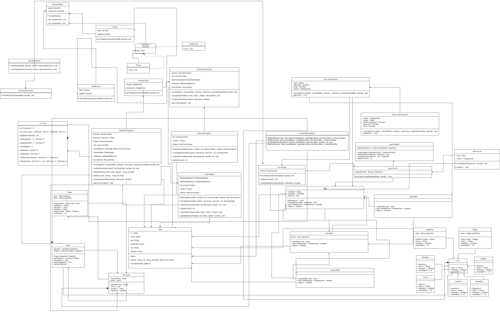

# indexOutOfBounds Report

*Here are some tips to write a good report:*

* *Try to summarise and list the `bullet points` of your project as many as possible rather than give long, tedious paragraphs that mix up everything together.*

* *Try to create `diagrams` instead of text descriptions, which are more straightforward and explanatory.*

* *Try to make your report `well structured`, which is easier for the reviewers to capture the necessary information.*

*We give instructions enclosed in square brackets [...] and examples for each sections to demonstrate what are expected for your project report.*

*Please remove the instructions or examples in `italic` in your final report.*

## Table of Contents

1. [Team Members and Roles](#team-members-and-roles)
2. [Summary of Individual Contributions](#summary-of-individual-contributions)
3. [Conflict Resolution Protocol](#conflict-resolution-protocol)
4. [Application Description](#application-description)
5. [Application UML](#application-uml)
6. [Application Design and Decisions](#application-design-and-decisions)
7. [Summary of Known Errors and Bugs](#summary-of-known-errors-and-bugs)
8. [Testing Summary](#testing-summary)
9. [Implemented Features](#implemented-features)
10. [Team Meetings](#team-meetings)

## Team Members and Roles

| UID |      Name      | Role |
| :--- |:--------------:| ---: |
| u7268598 | Devanshi Dhall | GUI, Login Screen, Data Structure, Singleton Design Pattern, Tokenizer and Parser, Testing, Report Writing, Firebase Authentication|
| u7399886 | Avani Dhaliwal | GUI, Data Structure, State Design Pattern, Report Writing, Bookmarks and Navigation Menu, Testing, Firebase Authentication|
| u7395484 | Nihar Meshram  | GUI, Facade Design Pattern, Firebase Realtime Database, Testing, UML Diagram, Payment Process |
| u6523462 |   Hao Zhang    | GUI, Facade Design Pattern, Firebase Realtime Database, Tokenizer and Parser, Testing, UML Diagram, Payment Process |

## Summary of Individual Contributions

### u7268598, Devanshi Dhall contributed 25% of the code. Here are the contributions:

**Code Implementation:**
* All classes in login package
* All classes in tokenizer package
* [Data.class](../../ga-22s2-comp2100-6442/app/src/main/java/au/edu/anu/cecs/linkhome/homePage/posts/Data.java): compareTo()
* [User.class](../../ga-22s2-comp2100-6442/app/src/main/java/au/edu/anu/cecs/linkhome/stateDesignPattern/User.java): getInstance()
* [Mastercard.class](../../ga-22s2-comp2100-6442/app/src/main/java/au/edu/anu/cecs/linkhome/homePage/payment/Mastercard.java): confirm.setOnClickListener()
* [Paypal.class](../../ga-22s2-comp2100-6442/app/src/main/java/au/edu/anu/cecs/linkhome/homePage/payment/Paypal.java): confirm.setOnClickListener()
* [PaymentSuccessful.class](../../ga-22s2-comp2100-6442/app/src/main/java/au/edu/anu/cecs/linkhome/homePage/payment/PaymentSuccessful.java)
* [DatabaseFragment.class](../../ga-22s2-comp2100-6442/app/src/main/java/au/edu/anu/cecs/linkhome/homePage/posts/DatabaseFragment.java): onCreateOptionsMenu()
* [PaymentMaker.class](../../ga-22s2-comp2100-6442/app/src/main/java/au/edu/anu/cecs/linkhome/facade/PaymentMaker.java): onCreateOptionsMenu()
* [BookmarkAdapter.class](../../ga-22s2-comp2100-6442/app/src/main/java/au/edu/anu/cecs/linkhome/homePage/bookmarks/BookmarkAdapter.java): checkBox()
* [AVLTree.class](../../ga-22s2-comp2100-6442/app/src/main/java/au/edu/anu/cecs/linkhome/avl/AVLTree.java): Creation and Insertion
* [BinarySearchTree.class](../../ga-22s2-comp2100-6442/app/src/main/java/au/edu/anu/cecs/linkhome/avl/BinarySearchTree.java)
* [EmptyTree.class](../../ga-22s2-comp2100-6442/app/src/main/java/au/edu/anu/cecs/linkhome/avl/EmptyTree.java)
* [Tree.class](../../ga-22s2-comp2100-6442/app/src/main/java/au/edu/anu/cecs/linkhome/avl/Tree.java)
* [AVLTreeTest.class](../../ga-22s2-comp2100-6442/app/src/test/java/au/edu/anu/cecs/linkhome/AVLTreeTest.java): immutableTest(), insertInOrderTest()
* [ParserTest.class](../../ga-22s2-comp2100-6442/app/src/test/java/au/edu/anu/cecs/linkhome/ParserTest.java)
* [homePageFragment.class](../../ga-22s2-comp2100-6442/app/src/main/java/au/edu/anu/cecs/linkhome/homePage/HomePageFragment.java): filterByRent(), filterByCity(), filterPosts()
* [MainActivity.class](../../ga-22s2-comp2100-6442/app/src/main/java/au/edu/anu/cecs/linkhome/MainActivity.java)
* Graphical User Interface/ Design:
  * layout/activity_detailed_page.xml
  * layout/activity_login.xml
  * layout/bookmark_fragment.xml
  * layout/activity_payment_successful.xml
  * layout/login_tab_fragment.xml
  * layout/signup_tab_fragment.xml
  * menu/search.xml

**Code Design:** Singleton Design pattern, AVL Tree, Tokenizer and Parser, Firebase Login Authentication

**UI Design:** Login, SignUp, SearchBar, Payment, Detailed Page information

**Report:** Team members and Roles, Summary of Individual Contributions, Conflict Resolution Protocol, Application Description, Team meetings (2,3,4)

### u7399886, Avani Dhaliwal contributed 25% of the code. Here are the contributions:

**Code Implementation:**
* All classes in stateDesignPattern package
* All classes in avl package
* [LoginAdapter.class](../../ga-22s2-comp2100-6442/app/src/main/java/au/edu/anu/cecs/linkhome/login/LoginAdapter.java)
* [LoginTabFragment.class](../../ga-22s2-comp2100-6442/app/src/main/java/au/edu/anu/cecs/linkhome/login/LoginTabFragment.java)
* [BookmarkFragment.class](../../ga-22s2-comp2100-6442/app/src/main/java/au/edu/anu/cecs/linkhome/homePage/bookmarks/BookmarkFragment.java )
* [DatabaseFragment.class](../../ga-22s2-comp2100-6442/app/src/main/java/au/edu/anu/cecs/linkhome/homePage/posts/DatabaseFragment.java)
* [DetailedPage.class](../../ga-22s2-comp2100-6442/app/src/main/java/au/edu/anu/cecs/linkhome/homePage/posts/DetailedPage.java)
* [HomePage.class](../../ga-22s2-comp2100-6442/app/src/main/java/au/edu/anu/cecs/linkhome/homePage/HomePage.java)
* [BookmarkAdapter.class](../../ga-22s2-comp2100-6442/app/src/main/java/au/edu/anu/cecs/linkhome/homePage/bookmarks/BookmarkAdapter.java)
* [DataAdapter.class](../../ga-22s2-comp2100-6442/app/src/main/java/au/edu/anu/cecs/linkhome/homePage/posts/DataAdapter.java): addDataToFirebase()
* [DataAdapter.class](../../ga-22s2-comp2100-6442/app/src/main/java/au/edu/anu/cecs/linkhome/homePage/posts/DataAdapter.java): deleteDataFromFirebase()
* [Data.class](../../ga-22s2-comp2100-6442/app/src/main/java/au/edu/anu/cecs/linkhome/homePage/posts/Data.java): compareTo()
* [homePageFragment.class](../../ga-22s2-comp2100-6442/app/src/main/java/au/edu/anu/cecs/linkhome/homePage/HomePageFragment.java)
* [AVLTreeTest.class](../../ga-22s2-comp2100-6442/app/src/test/java/au/edu/anu/cecs/linkhome/AVLTreeTest.java)
* [MainActivity.class](../../ga-22s2-comp2100-6442/app/src/main/java/au/edu/anu/cecs/linkhome/MainActivity.java)
* Graphical User Interface/ Design:
  * layout/activity_detailed_page.xml
  * layout/activity_home_page.xml
  * layout/activity_login.xml
  * layout/bookmark_fragment.xml
  * layout/nav_header.xml
  * menu/drawer_menu.xml
  
**Code Design:** State Design Pattern, AVL Tree, Firebase Login Authentication

**UI Design:** Navigation Bar, Detailed Page information, HashMap, HomePageFragment

**Report:** Summary of Individual Contributions, Team meeting 1, Application Design and Decisions, Summary of Known Errors and Bugs, Implemented Features

### u6523462, Hao Zhang contributed 25% of the code. Here are the contributions:

**Code Implementation:**
* All classes in facade package
* [DataAdapter.class](../../ga-22s2-comp2100-6442/app/src/main/java/au/edu/anu/cecs/linkhome/homePage/posts/DataAdapter.java)
* [Data.class](../../ga-22s2-comp2100-6442/app/src/main/java/au/edu/anu/cecs/linkhome/homePage/posts/Data.java)
* [Mastercard.class](../../ga-22s2-comp2100-6442/app/src/main/java/au/edu/anu/cecs/linkhome/homePage/payment/Mastercard.java)
* [Paypal.class](../../ga-22s2-comp2100-6442/app/src/main/java/au/edu/anu/cecs/linkhome/homePage/payment/Paypal.java)
* [DatabaseFragment.class](../../ga-22s2-comp2100-6442/app/src/main/java/au/edu/anu/cecs/linkhome/homePage/posts/DatabaseFragment.java): onDataChange(), onOptionsItemSelected(MenuItem item)
* [ParserTest.class](../../ga-22s2-comp2100-6442/app/src/test/java/au/edu/anu/cecs/linkhome/ParserTest.java)
* All classes in tokenizer package 
* Import and create Json File in Firebase
* Graphical User Interface/ Design:
  * activity_database.xml 
  * item.xml 
  * activity_mastercard.xml 
  * activity_paypal.xml 
  * activity_payment_page.xml 
* UML Diagram
  
**Code Design:** Facade Design Pattern, Tokenizer and Parser, Firebase Realtime Database 

**UI Design:** Images, Sort List Icons, RecyclerView List, Payment UI for MasterCard and Paypal, DataAdapter, Item images and description

**Report:** Summary of Individual Contributions, Application UML

**Slides:** Made the slides

### u7395484, Nihar Meshram contributed 25% of the code. Here are the contributions:

**Code Implementation:**
* [DataAdapter.class](../../ga-22s2-comp2100-6442/app/src/main/java/au/edu/anu/cecs/linkhome/homePage/posts/DataAdapter.java)
* [Data.class](../../ga-22s2-comp2100-6442/app/src/main/java/au/edu/anu/cecs/linkhome/homePage/posts/Data.java)
* [Mastercard.class](../../ga-22s2-comp2100-6442/app/src/main/java/au/edu/anu/cecs/linkhome/homePage/payment/Mastercard.java)
* [Paypal.class](../../ga-22s2-comp2100-6442/app/src/main/java/au/edu/anu/cecs/linkhome/homePage/payment/Paypal.java)
* [DetailedPage.class](../../ga-22s2-comp2100-6442/app/src/main/java/au/edu/anu/cecs/linkhome/homePage/posts/DetailedPage.java): mastercard.setOnClickListener(), paypal.setOnClickListener()
* [Mastercard.class](../../ga-22s2-comp2100-6442/app/src/main/java/au/edu/anu/cecs/linkhome/facade/Mastercard.java)
* [Payment.interface](../../ga-22s2-comp2100-6442/app/src/main/java/au/edu/anu/cecs/linkhome/facade/Payment.java)
* [PaymentMaker.class](../../ga-22s2-comp2100-6442/app/src/main/java/au/edu/anu/cecs/linkhome/facade/PaymentMaker.java)
* [Paypal.class](../../ga-22s2-comp2100-6442/app/src/main/java/au/edu/anu/cecs/linkhome/facade/Paypal.java)
* Import and create Json File in Firebase
* UML diagram
* Graphical User Interface/ Design:
  * activity_mastercard.xml 
  * activity_paypal.xml
  * activity_database.xml
  * item.xml
* Data generation
  
**Code Design:** Facade Design Pattern, Firebase Realtime Database

**UI Design:** Images, RecyclerView List, Payment UI for MasterCard and Paypal, DataAdapter, Item images and description, Logo

**Report:** Summary of Individual Contributions, Application Description, Application UML

**Slides:** Made the slides

## Conflict Resolution Protocol

We as a group feel it is vital to follow some guidelines/ rules while working on a group project.
If our group met with conflicts, following are the ways we used:
1. We catered the conflict with group meetings and productive discussions 
2. Every team member would patiently listen to other members speaking
3. Post listening to all the team members, our group would discuss the pros and cons of the idea
4. We would clarify the issue as a team and identify a feasible yet optimised solution to the problem

Following is an example of Conflict Resolution Protocol in our group:

Problem: Our group initially was confused which data structure to choose for our application. 
Solution: The members of the group discussed the strengths and weaknesses of the data structure that could be used to meet the requirements in our application. 
After a healthy discussion, we decided to go ahead with self balancing tree: AVL tree

## Application Description

Description:

Our application named "LinkHome" is a booking accommodation application that specialises in rental housing. 
Our application is focused towards building a strong and diverse culture among group of people by offering them rental property for their vacation mode.

Application workflow and features:

1. If a user is new to the app, then the user needs to sign up and create an account to add items to wishlist and confirm their booking as required. 
2. If the user already has an account on the application, then the user can directly sign in using the credentials. 
3. User can still view the properties without logging in the app but cannot wishlist the item.
4. Post login, the user can view a range of beautiful rental properties for their stay along with their description.
5. If a user likes one or more properties, then the user has the feature to save those for future preference to the wishlist page and view it later on.
6. The user can also sort the page basis the value of rent, either from high to low or low to high. 
7. The user can also filter the list of records basis their search for example: if a user wants to view all the properties in a particular city with rent less than 300, then it would filter those records.
8. After filtering, the user can also sort the filter records in ascending or descending values of rent.
9. Also, if a user wants to know more information about a particular house, then by clicking on the image would navigate to the detailed page of the property. 
10. The user can choose between two different payment options (MasterCard, Paypal) to confirm the booking. 
11. Once the payment page is loaded, if the particular property is a scam, an alert box pops up saying it is a scam, would you still like to make the payment? If a user clicks yes, then the payment is successful.

## Application Use Cases and or Examples

Here is a use case of our application: LinkHome

If a user plans a vacation to any place with his/ her family members and the user's preference is to stay in a large apartment for few days with all the available facilities, 
then LinkHome helps to meet all these requirements.

*Targets Users: Those who want to find good rental property for their vacation*

* Users can use the app to stay at beautiful houses during their stay.
* Users can build a strong community by meeting people from different cultures at that place.
* Users can use the app to navigate to their wishlist items and decide later on.
* Users can see on the navigation tab if they are logged in.
* Users can filter the list basis their city and rent preference.
* Users have the option to choose which payment method they are comfortable with.

## Application UML

**We have not included the following classes:**
* Tree.java, BinarySearchTree.java, EmptyTree.java as these classes are taken from lab04 and we have made less use of it.
* Also, we have excluded all the getters and setters method of the classes to increase the readability.

  

## Application Design and Decisions

**We used the following data structures in my project:**

**Data Structures**

1. **AVL Tree**

   * Objective: It is used for storing the searchable items in the list for search and sort features.

   * Locations: Under the package avl
      1. AVLTree.class
      2. BinarySearchTree
      3. EmptyTree
      4. Tree
      5. Lines 36-46; 54-62 in HomePageFragment.class()

   * Reasons:

     * It is more efficient than Arraylist for insertion with a time complexity O(log n)
     * AVL tree is a self balancing tree and can easily help in search features
     * It includes the property of Binary Search tree and can store the data
     * Also, sorting is easy as we can compare the values by using AVL tree properties
     

2.  **HashMap**

    * Objective: It is used for storing key value pairs of city and its corresponding AVL tree. 

    * Locations:
       1. DatabaseFragment.java
       2. BookmarkFragment.java
       3. HomePageFragment.java

    * Reasons:
      * This is because each city has its own AVl tree which makes it easier to filter.
      * Each city consists of only one AVL tree. With respect to the particular city, we would have a tree of all the values stored in it.
      * Since it does not include duplicates in the key, hence it would not generate another AVL tree.
      

3.  **ArrayList**

    * Objective: It is used for storing objects of class Data for our application.

    * Locations:
       1. BookmarkFragment.java
       2. DatabaseFragment.java
       3. DataAdapter.java
       4. BookmarkAdapter.java

    * Reasons:
      * It is easier to add and delete items from the arraylist as we are frequently using this in our application
        

**Design Patterns**

* **State Design Pattern:** Used in to go from Login State to Logout State
* **Singleton Design pattern:** Only one instance of User
* **Facade Design Pattern:** Used for the Payment process by using two different payment modes

**Grammar(s)**

Production Rules:

* exp = < city operator letter > | < rent operator coefficient > | < exp || exp > | < exp && exp >
* operator = < < | > | = > 
* coefficient = < unsigned integer >
* letter = < alphabets >

**Grammar Design**
* The grammar is designed by taking into account the search criteria in our application. 
* By making tha above mentioned grammar, it helps the user to filter records by city or rent or both.
* For example, the user can search by adding the below mentioned query in the search bar:
  * city=Canberra && rent<400
  * city=Canberra || rent>400
  * city=Canberra
  * rent>400
  * rent>300 && rent <400
  * rent>300 || rent<400

**Tokenizer and Parsers**

* Different types of tokens: INT, LESS, MORE, EQUAL, AND, OR, TEXT

**Surprise Item**

**For the surprise item**
* Our group thought of to make some rental property as scam
* If a user clicks on that scammed property, then the user would be notified by an alert box
* If the user still clicks "Ok", then the payment is successful
* If the user clicks "Cancel", then the user is navigated to the items page

## Summary of Known Errors and Bugs

**1. Bug 1:**
- Once the user sign up in the app, the app closes and user has to clear the cache
- Post that, the user can run the application again and sign in using the new credentials.

**2. Bug 2:**
- On the items page, every 6th image has an filled heart icon already but the 6th image is not added to the wishlist page since the user does not add it
- The particular 6th image is not added to the wishlist by the user

**3. Bug 3:**
- On the items page, when the user wants to search something such as city=Canberra then if the user writes anything instead of "city", still the search happens correctly

**4. Bug 4:**
- If the user wants to view the app in landscape mode and orientation changes, then it elements on the screen does not resize

## Testing Summary

- Number of test cases: 9 test methods for AVLTree, 7 test methods for Parser

- Code coverage: 25% as per android studio while running the test classes with the option "Run with Coverage"

- Types of tests created: AVLTree test, Parser test

## Implemented Features

### Feature Category: Search-related features  
#### Implemented features:  
1. Sort a list of products returned from a search based on price, popularity, rating, availability, etc.
   (easy)
   * The user can sort the posts in descending or ascending order of price
   * Package homePage/posts, Class DatabaseFragment, method onOptionsItemSelected, Lines of code: ...
   * GUI: menu.xml

2. Filter a list of products returned from a search based on their categories (e.g., kids, adults, kitchen,
   bedroom, etc.) (easy)
   * The user can filter the posts based on different cities. 
   * Package homePage/posts, Class DatabaseFragment, method onCreateOptionsMenu, filterByCity, Lines of code: ...
   * GUI: search.xml

### Feature Category: User Interactivity  
#### Implemented features:  
1. The ability to micro-interact with items in your app (e.g. add to watchlist/add to cart/like an
   item/report an item/add reviews (stars)) [stored in-memory]. (medium)
    * The user can save/remove a post to/from their wishlist. 
    * Package homePage/posts, Class DataAdapter, methods: checkBox, addDataToFirebase, removeDataFromFirebase, Lines of code: ... 
    * Package homePage/bookmarks, Class BookmarkAdapter
    * Package homePage/bookmarks, Class BookmarkFragment
    * GUI: menu.xml
    
### Feature Category: Creating Processes  
#### Implemented features:  
1. Payment process (fake process, do not connect to any payment provider). The user must choose
   between at least two different payment methods (e.g., credit card, cash, bitcoin). The payment
   method may add extra costs (e.g., credit card adds 1.5% to the total value). (easy)
    * The user can pay for a house using either Mastercard or PayPal. 
    * Package facade, Classes MasterCard, Payment, PaymentMaker, Paypal
    * Package homePage/payment, Classes MasterCard, PaymentPage, Paypal, PaymentSuccessful
    * Package homePage/posts, Class BookmarkAdapter
    * Package homePage/posts, Class BookmarkFragment
    * GUI: activity_mastercard.xml, activity_payment_page.xml, activity_payment_successful.xml, activity_paypal

### Feature Category: Firebase Integration  
#### Implemented features:  
1. Use Firebase to implement user Authentication/Authorisation. (easy)
   * User can both login and signup through Firebase Authenticati 2on/Authorisation. 
   * Package login, Class LoginTabFragment, method loginUser, Lines of code:...
   * Package login, Class SignUpTabFragment, method createUser, Lines of Code:...
   * GUI: activity_login.xml, login_tab_fragment.xml, signup_tab_fragment.xml

2. Use Firebase to persist all data used in your app. (medium)
   * All information about user posts is stored in Firebase realtime database
   * Package homePage/posts, Class DatabaseFragment, method onCreateView, Lines of Code:...
   * Package homePage/posts, Class DataAdapter, method addDataToFirebase, deleteDataFromFirebase, Lines of Code:... 
   * Package homePage/bookmarks, Class BookmarkFragment, method onCreateView, Lines of Code:...
   * GUI: item.xml, activity_database.xml, bookmark_fragment.xml, 

## Team Meetings

- *[Team Meeting 1](./meeting1.md)*
- *[Team Meeting 2](./meeting2.md)*
- *[Team Meeting 3](./meeting3.md)*
- *[Team Meeting 4](./meeting4.md)*